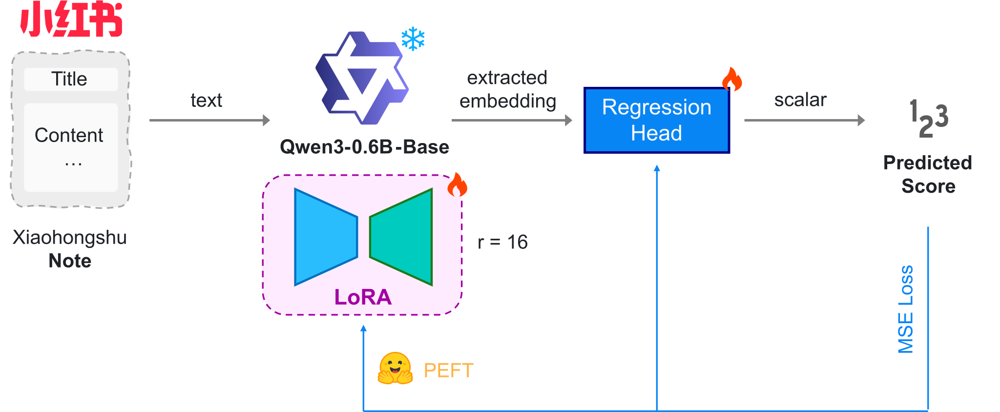

<p align="center">
  
</p>

<h1 align="center">
  RedNoob: Xiaohongshu popularity predictor via fine-tuned LLM
</h1>

<div align="center">
  <a href="https://github.com/Imiloin/RedNoob">
    </a>
  <a href="#">
    </a>
  <a href="#">
    </a>
  <a href="https://github.com/Imiloin/RedNoob?tab=MIT-1-ov-file#readme">
    </a>
</div>

本项目基于 [Qilin](https://huggingface.co/datasets/THUIR/Qilin) 数据集对 [Qwen3-0.6B-Base](https://huggingface.co/Qwen/Qwen3-0.6B-Base) 模型进行 LoRA 微调，通过分析小红书笔记的标题和内容，预测其潜在热度。

Qilin 数据集包含 1.98 M 条小红书笔记的标题、内容、点赞数、收藏数和评论数等信息，训练时滤除了视频笔记，仅使用了其中图文笔记（`note_type == 1`）的部分，约 1.39 M 条数据。

## Objective

项目的衡量指标为 WLAES（Weighted Logarithmic Accumulated Engagement Score，加权对数累计参与度分数），其公式为

$$
\text{WLAES} = 1.0 \cdot \log(n_\text{like} + 1) + 0.5 \cdot \log(n_\text{collect} + 1) + 0.2 \cdot \log(n_\text{comment} + 1)
$$

其中 $n_\text{like}$, $n_\text{collect}$, $n_\text{comment}$ 分别表示笔记的点赞数、收藏数和评论数。

数据集上 WLAES 分数的分布如下图所示：

<div align="center">
  
</div>

## Model

Qwen3-0.6B-Base 不具备多模态能力，项目中仅使用笔记的标题和内容文本进行热度预测。笔记的标题和内容会被组合成一个输入文本，作为模型的输入。

```python
input_text = f"帖子标题：{note_title}\n\n帖子内容：{note_content}"
```

组合后的文本使用 🤗 Transformers 的 [Qwen3ForSequenceClassification](https://huggingface.co/docs/transformers/main/en/model_doc/qwen3#transformers.Qwen3ForSequenceClassification) 提取最后一个 token 的 embedding 并通过一个线性层输出预测分数。LoRA 微调使用了 [PEFT](https://github.com/huggingface/peft) 提供的 `get_peft_model()` 方法。

<div align="center">
  
</div>

## Training

首先根据 `download.txt` 中的指令下载 Qilin 数据集和 Qwen3-0.6B-Base 预训练模型。

```bash
huggingface-cli download THUIR/Qilin --repo-type dataset --local-dir ./Qilin
huggingface-cli download Qwen/Qwen3-0.6B-Base --local-dir ./Qwen3-0.6B-Base
```

在 `config.yaml` 中配置了训练参数，包括学习率、批大小、LoRA 参数等，可自行配置。

使用 `train.sh` 脚本启动训练

```bash
bash train.sh
```

默认情况下，训练完成的模型会保存在 `./qwen3_wlaes_finetuned` 目录下。

## Result

构建均值预测和中位数预测两个简单的 baseline，在验证集中的分数预测表现如下表所示

|      | MAE↓ | RMSE↓ | R2↑ |
|:------|-------:|-------:|-----:|
| Mean Predictor | 5.579 | 6.778 | -0.0001 |
| Median Predictor | 5.578 | 6.779 | -0.0003 |
| LoRA Finetuned Qwen3 0.6B | **4.744** | **5.885** | **0.2461** |

## Inference

您可以从 [Coming Soon](#) 下载训练完成后的模型。同时也需要下载 Qwen3-0.6B-Base 模型。应当具有类似下面的目录结构

```text
.
├── config.yaml
├── infer.py
├── Qwen3-0.6B-Base
│   ├── config.json
│   ├── generation_config.json
│   ├── merges.txt
│   ├── model.safetensors
│   ├── README.md
│   ├── tokenizer_config.json
│   ├── tokenizer.json
│   └── vocab.json
├── qwen3_wlaes_finetuned
│   ├── adapter_config.json
│   ├── adapter_model.safetensors
│   ├── added_tokens.json
│   ├── merges.txt
│   ├── special_tokens_map.json
│   ├── tokenizer_config.json
│   ├── tokenizer.json
│   ├── training_args.bin
│   └── vocab.json
├── text_utils.py
├── train.py
```

直接使用 `infer.py`，或使用下面的代码进行推理

```python
import torch
from transformers import AutoTokenizer, AutoModelForSequenceClassification
from peft import PeftModel
from text_utils import combine_title_content
from train import load_config  # Re-use config loader


def predict_popularity(
    title: str, content: str, model, tokenizer, device, max_length: int
):
    """Predicts WLAES for a given title and content."""
    model.eval()  # Ensure model is in evaluation mode

    processed_text = combine_title_content(title, content)

    inputs = tokenizer(
        processed_text,
        return_tensors="pt",
        truncation=True,
        max_length=max_length,
        padding="max_length",  # Or False, and handle batching if predicting multiple
    )
    inputs = {k: v.to(device) for k, v in inputs.items()}

    with torch.no_grad():
        outputs = model(**inputs)
        logits = outputs.logits

    predicted_wlaes = logits.item()  # Assuming single prediction
    return predicted_wlaes


config = load_config()
device = torch.device("cuda" if torch.cuda.is_available() else "cpu")
print(f"Using device: {device}")

# --- 1. Load Tokenizer ---
tokenizer_path = config.get("trained_lora_path", config["output_dir"])
tokenizer = AutoTokenizer.from_pretrained(tokenizer_path, trust_remote_code=True)
if tokenizer.pad_token is None:
    tokenizer.pad_token = tokenizer.eos_token

# --- 2. Load Base Model and LoRA Adapters ---
base_model = AutoModelForSequenceClassification.from_pretrained(
    config["base_model_path"], num_labels=1, trust_remote_code=True
)
if base_model.config.pad_token_id is None:
    base_model.config.pad_token_id = tokenizer.pad_token_id

model = PeftModel.from_pretrained(base_model, config["trained_lora_path"])
# For inference, it's often better to merge the LoRA weights into the base model
model = model.merge_and_unload()
model.to(device)
model.eval()
print(f"Trained LoRA model loaded from {config['trained_lora_path']} and merged.")

# --- 3. Example Inference ---
sample_title = "这是一个很棒的标题！"
sample_content = "这里是一些帖子的内容。我们来测试一下这个模型的效果如何。\n它应该能根据文本预测受欢迎程度。包含一些特殊字符 \u200c 和表情 [大笑R] 以及话题 #测试一下[话题]#。"

predicted_score = predict_popularity(
    sample_title, sample_content, model, tokenizer, device, config["max_length"]
)
print(f"\n--- Example Inference ---")
print(f"Title: {sample_title}")
print(f"Content: {sample_content[:100]}...")  # Print first 100 chars of content
print(f"Predicted WLAES: {predicted_score:.4f}")
```

> [!NOTE]
> 小红书笔记的内容可能存在一些特殊格式，例如
>
> - 特殊字符（如零宽空格 `\u200c`，`\u200d`），数据预处理时会将其删除，不必关注。
> - 平台表情符号（如 `[哭惹R]`，`[萌萌哒R]`），需要用方括号括起并添加特殊的后缀 `R`。
> - 话题标签（如 `#可爱好物分享[话题]#`，`#大学生活[话题]#`），需要用 `#` 包裹并添加特殊的后缀 `[话题]`。
>
> 为了更好的预测结果，推理时的输入应当符合上述格式要求。

## Acknowledgements

小红书笔记的热度具有高度的随机性和不确定性，模型预测结果可能会受到话题热度、平台推流、封面质量、内容时效性和争议性等诸多因素的影响，发布笔记用户自身的影响力和粉丝数量也会对热度产生显著影响。模型的预测结果仅供参考，其绝对数值没有实际意义。

但是，模型仍然具有相对的参考价值，例如对标题和内容进行优化，可能会提高笔记的热度。

```python
# Score: 10.21
title_1 = "白天上班晚上上学 这破日子谁爱过谁过吧"
content_1 = "白天上班晚上上学 这破日子谁爱过谁过吧"

# Score: 13.18
title_2 = "ISTJ | 白天上班晚上上学 这破日子谁爱过谁过吧"
content_2 = "白天上班晚上上学 这破日子谁爱过谁过吧 #istj[话题]#"
```

> [!WARNING]
> 使用社交媒体的意义并不在于获取点赞、收藏和评论，而在于分享和交流。模型的预测结果仅供参考，切勿过度依赖。

项目的部分代码使用了 Gemini 2.5 Pro 和 Claude Sonnet 4 生成。

## Limitation

- **单一模态**：当前模型仅使用文本数据进行预测，未考虑图片、视频等多模态信息，这可能会影响预测的准确性。
- **数据集偏差**：Qilin 数据集进行了匿名化处理，不包含具有人像的笔记信息，存在潜在的偏差。虽然本模型不需要输入图像，但训练时依然启用了数据集中包含图像的笔记。如果你的笔记包含人像照片，由于缺乏相关训练，预测结果可能很差（毕竟，这个热度只取决于你🫵长得好不好看）。
- **模型尺寸**：Qwen3-0.6B-Base 仅有 0.6B 参数，可能无法捕捉到复杂的文本特征，导致预测效果有限。对于更复杂的任务，建议使用更大规模的模型。

[Qwen3-Embedding](https://qwenlm.github.io/blog/qwen3-embedding/) 系列模型已经发布！微调 Qwen3-Embedding 模型（或许）可以获得更好的效果。
